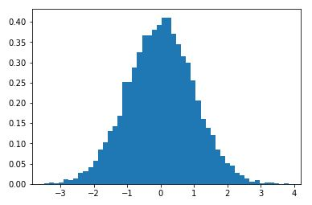
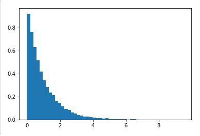
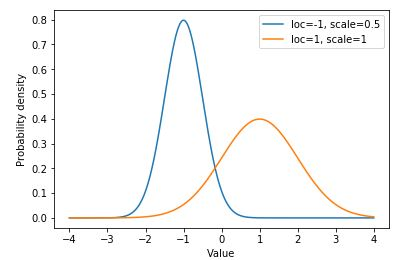
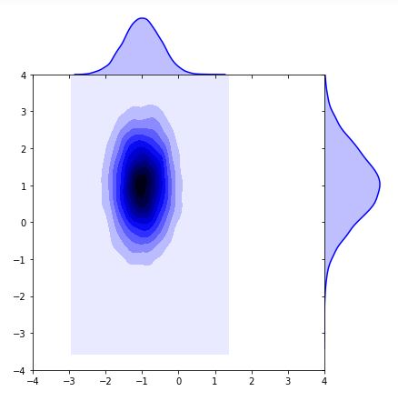
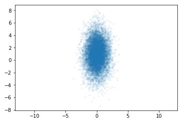
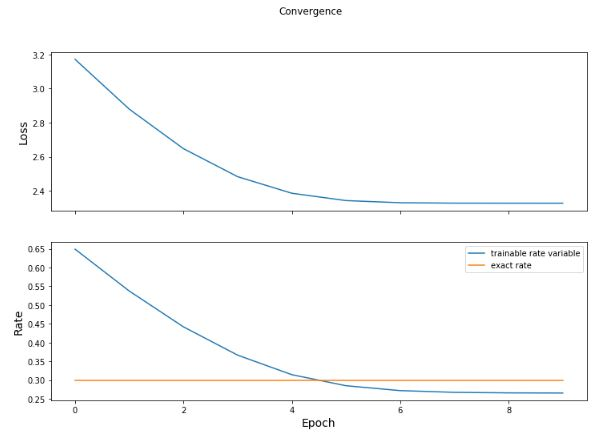

# TensorFlow Probability Distributions
- In this project, I explored how to use TensorFlow Probability (TFP) distributions to work with probabilistic models.
- You can get the code in [tensorflow_distributions.ipynb](./tensorflow_distributions.ipynb)

## Basic Distributions
- Implemented common distributions such as Normal and Exponential using TFP and visualized their properties.

### Normal Distribution:
- The basic normal distribution and its properties.

### Exponential Distribution:
- Visualizing the exponential distribution.

### Bivariate and Independent Distributions:
- Explored joint and independent distributions using TFP's `Independent` and `JointDistribution` APIs.

- Visualization of an independent distribution.

- A plot of a bivariate normal distribution.

### Multivariate Normal Distribution:
- Demonstrated the multivariate normal distribution with a diagonal covariance matrix.

### Loss Function:
- Implemented a loss function based on distribution log-likelihood for training.

- The loss curve during training.

## Setup
- Create virtual environment: `python -m venv venv`
- Activate virtual environment: `call venv/Scripts/activate.bat` in cmd
- Install dependencies: `pip install -r requirements.txt`

# Libraries
- TensorFlow Probability
- TensorFlow
- Numpy
- Matplotlib

## Contact
- LinkedIn: [Natan Asrat](https://linkedin.com/in/natan-asrat)
- Gmail: nathanyilmaasrat@gmail.com
- Telegram: [Natan Asrat](https://t.me/fail_your_way_to_success)
- Youtube: [Natville](https://www.youtube.com/@natvilletutor)
